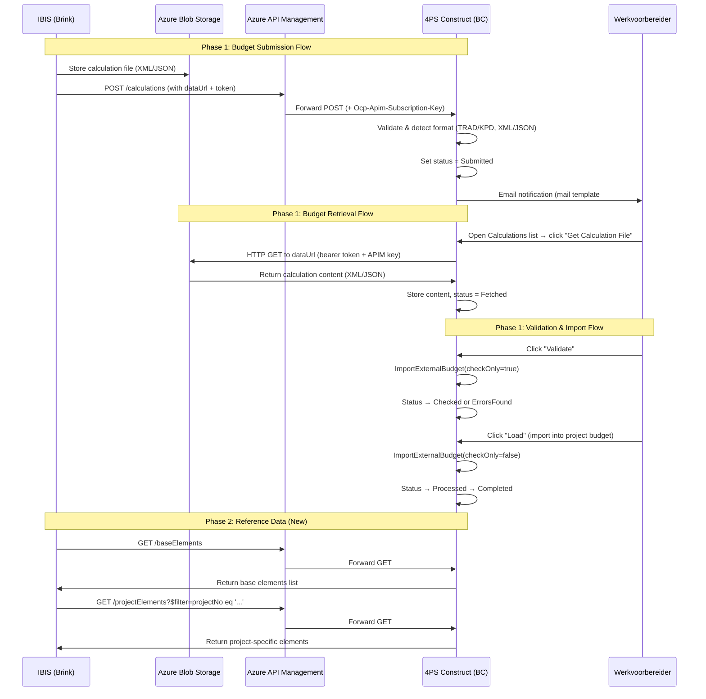
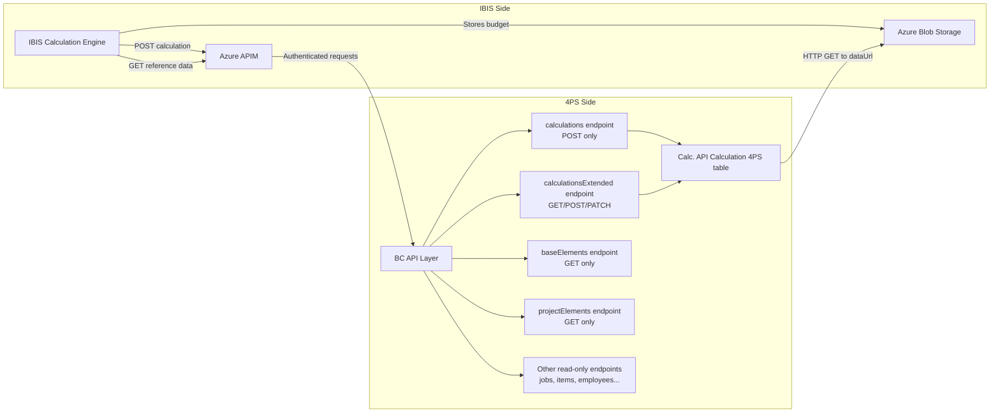
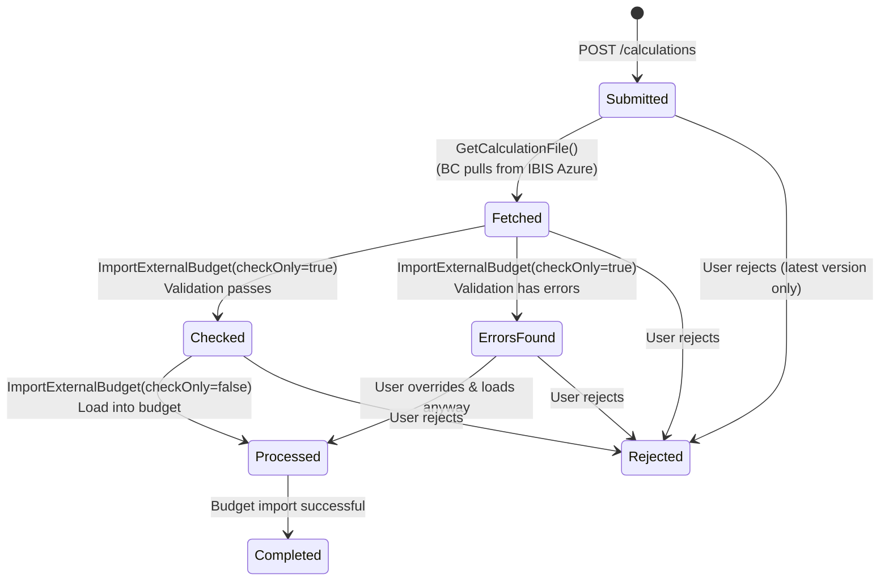
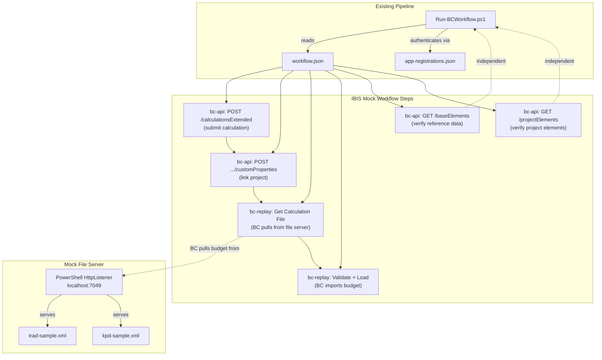
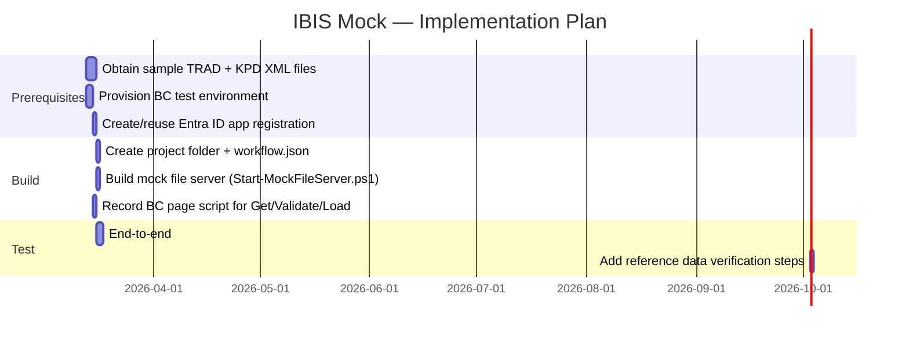

# Research: Mocking the IBIS Calculation Integration

> **Date:** 2025-03-12  
> **Epic:** [FPS-8992 — Phase 2 IBIS API Integration](https://4ps.atlassian.net/browse/FPS-8992)  
> **Related Jira:** [FPS-13330](https://4ps.atlassian.net/browse/FPS-13330), [FPS-13331](https://4ps.atlassian.net/browse/FPS-13331)  
> **Scope Documents:** DR-788 (Phase 2), DR-972 (Infra elements), DR-973 (Construction elements)

---

## Table of Contents

1. [Executive Summary](#1-executive-summary)
2. [Integration Context](#2-integration-context)
3. [Architecture Overview](#3-architecture-overview)
4. [API Endpoint Inventory](#4-api-endpoint-inventory)
5. [Data Model Analysis](#5-data-model-analysis)
6. [Status Workflow & State Machine](#6-status-workflow--state-machine)
7. [IBIS-Specific Domain Mapping](#7-ibis-specific-domain-mapping)
8. [Mock Scope & Strategy](#8-mock-scope--strategy)
9. [Test Scenario Specifications — Happy Flow](#9-test-scenario-specifications--happy-flow)
10. [Sample Data Requirements](#10-sample-data-requirements)
11. [Open Questions](#11-open-questions)
12. [Implementation Roadmap](#12-implementation-roadmap)
13. [References](#13-references)

---

## 1. Executive Summary

The IBIS Calculation Integration connects **IBIS** (Brink Software's estimation platform for construction and infrastructure) with **4PS Construct** (Business Central ERP). It allows estimators to submit budgets from IBIS which are then validated, reviewed, and imported into 4PS project budget lines.

**Phase 2** extends the integration by making additional data tables available — specifically **elements** (base elements and project elements) — so IBIS can retrieve cost carrier and element mappings from 4PS. This enables smoother joint implementations for both infrastructure (Infra) and construction (Bouw) customers.

This document researches what is needed to create an **IBIS mock** (test harness) that simulates IBIS's behaviour to **test the 4PS Construct BC API endpoints**. The mock acts as IBIS — submitting calculation budgets, hosting budget files for BC to pull, and reading reference data — so 4PS developers can validate the BC-side integration logic without needing the real IBIS system.

---

## 2. Integration Context

### 2.1 Business Background

IBIS (by Brink Software) is the leading estimation/calculation software for Dutch construction and infrastructure markets. The integration makes IBIS budgets directly available to 4PS Construct ERP without information loss.

**Key stakeholders:**
- **Roderik von Maltzahn** (Brink/IBIS) — integration partner
- **Customers:** GMB, Van Gelder, Padelbouw, Roosdom Tijhuis
- **Target markets:** NL construction & infrastructure, DE/BE construction

### 2.2 Integration Pattern

BC acts as **both API provider and API consumer**:

| Direction | Pattern | Description |
|-----------|---------|-------------|
| **IBIS → 4PS** | REST POST | IBIS submits a calculation budget to BC's `/calculations` endpoint |
| **4PS → IBIS** | HTTP GET (Pull) | BC fetches the actual budget file content from IBIS's Azure-hosted endpoint via `dataUrl` + bearer token |
| **IBIS → 4PS** | REST GET | IBIS reads reference data (elements, projects, items) from BC's read-only API endpoints |
| **4PS → IBIS** | Status feedback | Approval/rejection status communicated back (via API status field) |

### 2.3 Authentication Architecture

From the project documentation:

- BC endpoints require **OAuth 2.0** authentication (multi-tenant compliant)
- IBIS stores budget files in **Azure Blob Storage**; BC retrieves them via HTTP GET with a **bearer token**
- An **Azure API Management** (APIM) layer sits in front with an `Ocp-Apim-Subscription-Key` header
- Three solution options were evaluated for URL generation and client ID/secret management (see DR-788 scope document)

**Source:** Architecture discussion notes from project kick-off meetings (2021-2022)

---

## 3. Architecture Overview





---

## 4. API Endpoint Inventory

All endpoints use: `APIPublisher = '4ps'`, `APIGroup = 'calculation'`

### 4.1 Base URL Pattern

```
https://{bchost}/{instance}/api/4ps/calculation/{version}/companies({companyId})/
```

### 4.2 Core Endpoints (Phase 1 + 2)

| # | Entity Set Name | Version | Methods | Source Table | Purpose | Source File |
|---|----------------|---------|---------|-------------|---------|------------|
| 1 | `calculations` | v1.1 | POST | Calc. API Calculation 4PS | Submit calculation budgets | [CalcApiCalculationsApi.Page.al] |
| 2 | `calculationsExtended` | v1.0 | GET/POST/PATCH | Calc. API Calculation 4PS + ext | Extended calc with dataUrl/token | [4PSCalculationAPI.Page.al] |
| 3 | `baseElements` | v1.1 | GET | Base Element | **Phase 2** — standard element master data | [CalcApiBaseElement4PS.Page.al] |
| 4 | `projectElements` | v1.1 | GET | Project Element | **Phase 2** — project-specific elements | [CalcApiProjectElement4PS.Page.al] |

### 4.3 Supporting Read-Only Endpoints

| # | Entity Set Name | Version | Source Table | Purpose | Source File |
|---|----------------|---------|-------------|---------|------------|
| 5 | `employees` | v1.1 | Employee | Employee master data | [CalcApiEmployee4PS.Page.al] |
| 6 | `employeeCostPrices` | v1.1 | Employee Cost Price | Hourly rates | [CalcApiEmployeeCostPrice4PS.Page.al] |
| 7 | `items` | v1.1 | Item | Item catalog | [CalcApiItem4PS.Page.al] |
| 8 | `itemVendors` | v1.1 | Item Vendor | Item-vendor mapping | [CalcApiItemVendor4PS.Page.al] |
| 9 | `jobs` | v1.1 | Job | Project master data | [CalcApiJob4PS.Page.al] |
| 10 | `plots` | v1.1 | Plot | Plot data (housing) | [CalcApiPlot4PS.Page.al] |
| 11 | `extensionContracts` | v1.1 | Extension Contract | Change orders | [CalcApiExtContract4PS.Page.al] |
| 12 | `plantNumbers` | v1.1 | Plant Number | Equipment catalog | [CalcApiPlantNumber4PS.Page.al] |
| 13 | `rentalRates` | v1.1 | Rental Rate | Equipment rental pricing | [CalcApiRentalRate4PS.Page.al] |
| 14 | `tradeItems` | v1.1 | Trade Item | Trade item catalog | [CalcApiTradeItem4PS.Page.al] |
| 15 | `priceHistoryTradeItems` | v1.1 | Price History Trade Item | Historical pricing | [CalcApiPriceHistTradeItem4PS.Page.al] |
| 16 | `etimVendorContactManagements` | v1.1 | Etim Vendor Cntct. Mgt. | Vendor contact lookup | [CalcApiEtimVendorCntMgt4PS.Page.al] |
| 17 | `etimVendorLocalManagements` | v1.1 | Etim Vendor Local Mgt. | Local vendor management | [CalcApiEtimVendorLocalMgt4PS.Page.al] |
| 18 | `projectAuthorizations` | v1.1 | Project Authorization | Project permissions | [CalcApiProjectAuth4PS.Page.al] |
| 19 | `projectPrincipals` | v1.1 | Project Principal | Client/principal data | [CalcApiProjectPrinc4PS.Page.al] |
| 20 | `projectResponsiblePersons` | v1.1 | Proj. Resp. Pers. | Responsible person per project | [CalcApiProjRespPers4PS.Page.al] |

### 4.4 Nested Entity (Subpage)

| Parent | Nested Entity | Multiplicity | Purpose |
|--------|--------------|-------------|---------|
| `calculationsExtended` | `customProperties` | ZeroOrOne | Company, project, contract, budget adjustment IDs |

---

## 5. Data Model Analysis

### 5.1 Calculation Record (Calc. API Calculation 4PS)

**Primary Key:** `Calculation Id` (Guid) + `Calculation Version` (Code[50])

#### Base Table Fields (W1)

| Field | Type | Description | API Name (`calculations`) | API Name (`calculationsExtended`) |
|-------|------|-------------|--------------------------|----------------------------------|
| Calculation Id | Guid | Unique calculation identifier | `calculationId` | `fileId` |
| Calculation Version | Code[50] | Version number | `calculationVersion` | `fileVersion` |
| Project No. | Code | Linked BC project | `projectNo` | *(via customProperties.jobId)* |
| Project Description | Text | Project name | `projectDescription` | — |
| Extension Contract No. | Code | Change order link | `extensionContractNo` | *(via customProperties.extensionContract)* |
| Budget Adjustment No. | Code | Budget adjustment link | `budgetAdjustmentNo` | *(via customProperties.adjustment)* |
| Status | Enum | Workflow state | `status` | `status` |
| Calculation Content | Blob | Raw XML/JSON budget file | `calculationContent` | `calculationContent` |
| Calculation Type | Enum | Trad / Kpd / Unknown | — | — |
| Calculation Language | Enum | Xml / Json / Unknown | — | — |
| Errors | Blob | Validation error log | `Errors` | — |
| Reason for Rejection | Text[500] | Why calculation was rejected | `reasonForRejection` | `reasonForRejection` |
| Email Sent On | DateTime | Notification tracking | — | — |

**Source:** [4PS Calculation API W1/app/src/table/](../../../4PS%20Calculation%20API%20W1/) (base table in W1 dependency)

#### Extension Fields (NL)

| Field | Type | Description | API Name |
|-------|------|-------------|----------|
| Data Url | Text[250] | Azure Blob Storage URL for budget file | `dataUrl` |
| Data Token | Blob | Bearer token for HTTP GET | `token` |

**Source:** [4PSCalculationApiCalc.TableExt.al](../app/src/tableextension/4PSCalculationApiCalc.TableExt.al)

### 5.2 Custom Properties (Virtual Subpage)

The `customProperties` nested entity uses a **temporary table** — it doesn't have its own storage but writes through to the parent Calculation record:

| Field | Type | Description |
|-------|------|-------------|
| companyId | Text | BC Company GUID (validated against Company table) |
| jobId | Text | Project number (maps to `Project No.`) |
| extensionContract | Text | Extension contract number |
| adjustment | Text | Budget adjustment number |

**Source:** [4PSCalculationApi2.Page.al](../app/src/page/API/4PSCalculationApi2.Page.al)

### 5.3 Base Element

| Field | Type | API Name |
|-------|------|----------|
| Code | Code[20] | `code` |
| Search Code | Code | `searchCode` |
| Description | Text | `description` |
| Level | Option | `level` |
| Chapter | Boolean | `chapter` |
| Paragraph | Boolean | `paragraph` |
| Quantity | Decimal | `quantity` |
| Unit of Measure | Code | `unitOfMeasure` |
| Element Type | Option | `elementType` |
| Planning Activity Type | Option | `planningActivityType` |
| Standard Object | Code | `standardObject` |
| Previous Element | Code | `previousElement` |
| Lead Time (Days) | Integer | `leadTimeDays` |
| Responsible Employee | Code | `responsibleEmployee` |
| Responsible Employee Name | Text | `responsibleEmployeeName` |
| Plot Build Stage | Code | `plotBuildStage` |
| Discipline | Code | `discipline` |

**Source:** [CalcApiBaseElement4PS.Page.al](../../4PS%20Calculation%20API%20W1/app/src/api/CalcApiBaseElement4PS.Page.al)  
**IBIS mapping (Infra):** `Vrije code 1 en 2 = element 4PS`  
**IBIS mapping (Bouw):** `Calculatiecode, alternatieve code of bestekcode = elementen 4PS`

### 5.4 Project Element

All fields from Base Element, plus project-specific budget aggregations:

| Additional Field | Type | API Name |
|-----------------|------|----------|
| Project No. | Code[20] | `projectNo` |
| Element Budget | Decimal | `elementBudget` |
| Paragraph Budget | Decimal | `paragraphBudget` |
| Chapter Budget | Decimal | `chapterBudget` |
| Project Total | Decimal | `projectTotal` |
| Budget Hours (Order) | Decimal | `budgetHoursOrder` |
| Element Labor / Material / SubContr / Plant / Sundry | Decimal | `element{Type}` |
| Starting Date / Ending Date | Date | `startingDate` / `endingDate` |
| Blocked | Boolean | `blocked` |
| Phase Code | Code | `phaseCode` |
| ... *(30+ fields total)* | | |

**Source:** [CalcApiProjectElement4PS.Page.al](../../4PS%20Calculation%20API%20W1/app/src/api/CalcApiProjectElement4PS.Page.al)

---

## 6. Status Workflow & State Machine

The calculation record follows a defined status progression:



**Enum values** (Extensible):

| Value | Description | Trigger |
|-------|-------------|---------|
| `Submitted` | Initial state after IBIS POST | OnInsert trigger |
| `Fetched` | Content retrieved from Azure | `GetCaculationFile()` codeunit |
| `Checked` | Validation passed (no errors) | `ImportExternalBudget(true)` |
| `ErrorsFound` | Validation found issues | `ImportExternalBudget(true)` |
| `Processed` | Imported into project budget | `ImportExternalBudget(false)` |
| `Completed` | Final successful state | After Processed |
| `Rejected` | User rejected the calculation | Manual action |

**Source:** [Enum CalcApi Status 4PS (11125235)](../../4PS%20Calculation%20API%20W1/app/src/enumerate/)

### 6.1 Automatic Actions on Status Change

| Event | Action |
|-------|--------|
| OnInsert (Submitted) | Auto-detect `CalculationLanguage` (XML/JSON) and `CalculationType` (TRAD/KPD) from content |
| OnInsert (if Project No. set) | Send email to Project Engineer via mail template #450 |
| Fetched | Content blob populated, language/type re-detected |
| ErrorsFound | Errors blob populated with validation report |
| Rejected | Only allowed on the latest version (checked by `IsLatest()`) |

---

## 7. IBIS-Specific Domain Mapping

### 7.1 Calculation Types

The integration handles two distinct IBIS calculation formats:

| IBIS Product | Calculation Type | Format | Root XML Element | Target Market |
|-------------|-----------------|--------|------------------|--------------|
| IBIS Calculeren voor Bouw | `Trad` | XML (TRAD) | `TradbegrotingIbis` | Construction |
| IBIS Calculeren voor Infra | `Kpd` | XML (KPD) | `IbisVoorInfra` | Infrastructure |

**Detection logic** (from `SetCalculationType()` in base table):
- Parse root element of XML/JSON content
- `TradbegrotingIbis` → Type = Trad
- `IbisVoorInfra` → Type = Kpd
- Otherwise → Type = Unknown (error)

### 7.2 IBIS-to-4PS Field Mapping

#### Infrastructure (Infra)

| IBIS Concept | IBIS Field | 4PS Entity | 4PS Field |
|-------------|-----------|-----------|----------|
| Sorteercode | Sorteercode Ibis Infra | Cost Carrier (Kostendrager) | *(via budget lines)* |
| Vrije code 1 & 2 | Vrije code | **`baseElements`** / **`projectElements`** | `element` / `code` |

#### Construction (Bouw)

| IBIS Concept | IBIS Field | 4PS Entity | 4PS Field |
|-------------|-----------|-----------|----------|
| Bewakingscodes (materiaal, materieel, arbeid, onderaanneming) | Codelijst Ibis Bouw | Cost Carrier (Kostendrager) | *(via budget lines)* |
| Calculatiecode / alternatieve code / bestekcode | Codelijst Ibis Bouw | **`baseElements`** / **`projectElements`** | `element` / `code` |

> **Key insight from 4PS documentation:** Coding consistency between external estimating tools and 4PS elements is *critical* to avoid import errors. Elements in IBIS must match the element codes configured in 4PS Construct. ([Source: 4PS Knowledge Base](https://4ps.atlassian.net/wiki/spaces/4BP/pages/1827405977/Elements))

### 7.3 Budget File Content

- **First version:** XML format (both TRAD and KPD)
- **JSON support:** Added later; BC auto-converts JSON→XML if needed before import
- Includes: all budget lines, quantities, rates, RAW texts for quotes, element codes
- **On update:** IBIS re-sends the *complete* budget (not deltas), with a new version number
- **In 4PS:** New versions are *appended*, not overwritten. Old budget lines must be manually deleted if replacement is desired.

---

## 8. Mock Scope & Strategy

### 8.1 Scope: Happy Flow Only

The mock focuses exclusively on the **happy path** — verifying BC correctly receives, processes, and imports an IBIS calculation budget end-to-end. Error paths, version conflicts, and edge cases are out of scope.

**In scope:**

| Step | What It Tests | How |
|------|--------------|-----|
| Submit a TRAD calculation to BC | BC accepts POST, creates record with status `Submitted` | `bc-api` step: `POST /calculationsExtended` |
| Link custom properties | BC stores company/project linkage | `bc-api` step: `POST /calculationsExtended({id})/customProperties` |
| Pull budget file into BC | BC retrieves content from `dataUrl`, status becomes `Fetched` | `bc-replay` step: user clicks "Get Calculation File" in BC UI |
| Validate calculation | BC checks import, status becomes `Checked` | `bc-replay` step: user clicks "Validate" |
| Import into project budget | BC imports budget lines, status becomes `Completed` | `bc-replay` step: user clicks "Load" |
| Read base elements | BC returns element master data via API | `bc-api` step: `GET /baseElements` |
| Read project elements | BC returns project-specific elements | `bc-api` step: `GET /projectElements?$filter=projectNo eq '...'` |

**Out of scope:** error paths, invalid submissions, version conflicts, malformed files, authentication edge cases.

### 8.2 Pipeline Integration

The mock is **not** a standalone script. It runs as a `workflow.json` inside the existing `page-scripting/` folder structure, executed by `Run-BCWorkflow.ps1`. This gives us:

- **Same execution pipeline** as all other BC page script tests
- **Capture/inject** to pass values (e.g., `systemId`) between API calls and UI steps
- **Unified reporting** via Playwright test results
- **Credential management** via `app-registrations.json` (OAuth 2.0 client credentials)

### 8.3 Architecture



### 8.4 Project Folder Structure

Following the existing convention, the mock lives in its own project folder:

```
page-scripting/
  IBIS Calculation Import/
    workflow.json              # Workflow definition (bc-api + bc-replay steps)
    app-registrations.json     # OAuth credentials (gitignored)
    app-registrations.sample.json
    users.json                 # BC user credentials for UI steps
    users.sample.json
    Process.md                 # Business process documentation
    scripts/
      get-and-import-calculation.yml   # Recorded BC page script
    files/
      trad-sample.xml          # Sample TRAD budget for file server
      kpd-sample.xml           # Sample KPD budget for file server
    Start-MockFileServer.ps1   # Starts the local file server
```

### 8.5 The Mock File Server

The only new infrastructure component. BC's `GetCalculationFile()` action pulls budget content from a `dataUrl` via HTTP GET. The mock file server hosts the sample budget files so BC has something to pull from.

| Aspect | Approach |
|--------|----------|
| **Technology** | PowerShell `HttpListener` on `localhost:7049` |
| **Auth** | Level 0 — serve files without checking headers (happy flow) |
| **Content** | Static XML files from the `files/` folder |
| **Lifecycle** | Started before the workflow, stopped after |
| **Reachability** | Must be accessible from the BC instance — localhost works for containers; cloud BC needs a tunnel or public URL |

---

## 9. Test Scenario Specifications — Happy Flow

All scenarios follow the happy path. The mock drives two end-to-end flows and two reference data checks, all expressed as `workflow.json` steps.

### 9.1 Scenario: TRAD Calculation — Full Import

**Purpose:** Verify BC correctly receives, fetches, validates, and imports a construction (Bouw) budget.

| Step | Type | Action | Expected BC Behaviour | Captures |
|------|------|--------|----------------------|----------|
| 1 | `bc-api` | `POST /calculationsExtended` with `dataUrl` pointing to mock file server, `token` = test value | `201 Created`, `status` = `Submitted`, auto-detects `calculationType` = `Trad` | `systemId`, `fileId` |
| 2 | `bc-api` | `POST /calculationsExtended({systemId})/customProperties` with `companyId`, `jobId` | `200 OK`, properties linked | — |
| 3 | `bc-replay` | Open Calculations list, find the submitted record, click **"Get Calculation File"** | BC pulls from `dataUrl` (mock file server), `status` = `Fetched` | — |
| 4 | `bc-replay` | Click **"Validate"** | `status` = `Checked` | — |
| 5 | `bc-replay` | Click **"Load"** | Budget imported into project, `status` = `Completed` | — |
| 6 | `bc-api` | `GET /calculationsExtended({systemId})` | Verify `status` = `Completed` | — |

### 9.2 Scenario: KPD Calculation — Full Import

**Purpose:** Same as 9.1 but with infrastructure (Infra) budget format.

Identical steps to 9.1, substituting:
- Budget file: `kpd-sample.xml` (root element `<IbisVoorInfra>`)
- Assert `calculationType` = `Kpd`

### 9.3 Scenario: Read Base Elements (Phase 2)

**Purpose:** Verify BC's `baseElements` endpoint returns the element hierarchy.

| Step | Type | Action | Expected BC Behaviour |
|------|------|--------|----------------------|
| 1 | `bc-api` | `GET /baseElements` | Returns OData response with `value` array containing elements with `code`, `description`, `level`, `chapter`, `elementType` |
| 2 | `bc-api` | `GET /baseElements?$filter=level eq 1` | Returns only chapter-level elements |

### 9.4 Scenario: Read Project Elements (Phase 2)

**Purpose:** Verify BC's `projectElements` endpoint returns budget data for a specific project.

| Step | Type | Action | Expected BC Behaviour |
|------|------|--------|----------------------|
| 1 | `bc-api` | `GET /projectElements?$filter=projectNo eq '{testProjectNo}'` | Returns elements with populated `elementBudget`, `paragraphBudget`, `chapterBudget`, `projectTotal` |

### 9.5 Draft workflow.json

This is the target `workflow.json` for the IBIS Calculation Import workflow. Placeholder values (URLs, project numbers) must be filled in based on the actual BC test environment.

```json
{
  "name": "IBIS Calculation Import — Happy Flow",
  "description": "Submits a TRAD calculation to BC, pulls budget file, validates, and imports into project budget",
  "bc_url": "https://{{bc_host}}/{{tenantId}}/{{environmentName}}",
  "steps": [
    {
      "id": "submit-calculation",
      "name": "Submit TRAD calculation via API",
      "user": "system",
      "type": "bc-api",
      "method": "POST",
      "endpoint": "https://{{bc_api_host}}/v2.0/{{tenantId}}/{{environmentName}}/api/4ps/calculation/v1.0/companies({{companyId}})/calculationsExtended",
      "app_registration": "ibis-mock",
      "body_template": {
        "dataUrl": "http://localhost:7049/files/trad-sample.xml",
        "token": "mock-bearer-token",
        "fileVersion": "1"
      },
      "capture_response": {
        "calc_system_id": "$.systemId",
        "calc_file_id": "$.fileId"
      }
    },
    {
      "id": "link-custom-properties",
      "name": "Link project to calculation",
      "user": "system",
      "type": "bc-api",
      "method": "POST",
      "endpoint": "https://{{bc_api_host}}/v2.0/{{tenantId}}/{{environmentName}}/api/4ps/calculation/v1.0/companies({{companyId}})/calculationsExtended({capture.submit-calculation.calc_system_id})/customProperties",
      "app_registration": "ibis-mock",
      "body_template": {
        "companyId": "{{companyId}}",
        "jobId": "PRJ-001"
      },
      "depends_on": "submit-calculation"
    },
    {
      "id": "get-and-import",
      "name": "Fetch, validate, and import calculation in BC",
      "user": "werkvoorbereider",
      "script": "./scripts/get-and-import-calculation.yml",
      "inject": {
        "CalcApi Calculations 4PS.fileId": "{capture.submit-calculation.calc_file_id}"
      },
      "depends_on": "link-custom-properties"
    },
    {
      "id": "verify-status",
      "name": "Verify calculation status is Completed",
      "user": "system",
      "type": "bc-api",
      "method": "GET",
      "endpoint": "https://{{bc_api_host}}/v2.0/{{tenantId}}/{{environmentName}}/api/4ps/calculation/v1.0/companies({{companyId}})/calculationsExtended({capture.submit-calculation.calc_system_id})",
      "app_registration": "ibis-mock",
      "capture_response": {
        "final_status": "$.status"
      },
      "depends_on": "get-and-import"
    },
    {
      "id": "read-base-elements",
      "name": "Verify base elements are accessible",
      "user": "system",
      "type": "bc-api",
      "method": "GET",
      "endpoint": "https://{{bc_api_host}}/v2.0/{{tenantId}}/{{environmentName}}/api/4ps/calculation/v1.1/companies({{companyId}})/baseElements",
      "app_registration": "ibis-mock"
    },
    {
      "id": "read-project-elements",
      "name": "Verify project elements for test project",
      "user": "system",
      "type": "bc-api",
      "method": "GET",
      "endpoint": "https://{{bc_api_host}}/v2.0/{{tenantId}}/{{environmentName}}/api/4ps/calculation/v1.1/companies({{companyId}})/projectElements?$filter=projectNo eq 'PRJ-001'",
      "app_registration": "ibis-mock"
    }
  ]
}
```

> **Note:** The `bc-replay` step `get-and-import` requires a recorded page script. This YAML script must be recorded in BC by navigating to the Calculations list, finding the submitted record, and performing: Get Calculation File, Validate, Load. See Section 8.1 for the UI actions involved.

---

## 10. Sample Data Requirements

### 10.1 Sample Budget Files

Two budget files are needed for the mock file server. These must be valid enough for BC to parse, validate, and import.

| File | Format | Root Element | Purpose |
|------|--------|-------------|---------|
| `trad-sample.xml` | TRAD XML | `<TradbegrotingIbis>` | Construction budget — must contain element codes matching the BC test company's base elements |
| `kpd-sample.xml` | KPD XML | `<IbisVoorInfra>` | Infrastructure budget — element codes matching `Vrije code 1 en 2` patterns |

**Where to get these:** Ask QA or check the AL test codeunit (`TestCalculationAPI`) for embedded test XML snippets. Alternatively, request sanitised files from a customer implementation.

### 10.2 BC Test Environment Prerequisites

The BC instance must have this data pre-configured for the happy flow to succeed:

| Entity in BC | Minimum Records | Why |
|-------------|----------------|-----|
| Projects (Jobs) | 1 test project (e.g., `PRJ-001`) | Calculation is linked to this project via `customProperties.jobId` |
| Base Elements | 15-20 | Element codes in the budget file must exist in BC |
| Project Elements | 10-15 tied to the test project | So `GET /projectElements` returns meaningful data |
| Calc. API Setup | Configured | Mail template, APIM key, and other settings must be in place |

### 10.3 Mock File Server Content

The `files/` folder in the project directory hosts the static content served by `Start-MockFileServer.ps1`:

```
files/
  trad-sample.xml    # Served at http://localhost:7049/files/trad-sample.xml
  kpd-sample.xml     # Served at http://localhost:7049/files/kpd-sample.xml
```

The `dataUrl` in the API POST body points to one of these URLs. BC's `GetCalculationFile()` action will HTTP GET this URL to retrieve the budget content.

---

## 11. Open Questions

| # | Question | Impact | For |
|---|----------|--------|-----|
| 1 | Which BC test environment should the mock target? (COSMO Alpaca container, sandbox, or dedicated tenant?) | Determines base URL, auth config, and available test data | Architect |
| 2 | Can `GetCalculationFile()`, `Validate`, and `Load` be triggered via API, or only via the BC UI? If UI-only, the `bc-replay` step requires a recorded page script | Determines if the workflow is fully API or mixed API+UI | Developer |
| 3 | Can the mock file server on `localhost` be reached from the BC instance? For cloud BC, a tunnel (ngrok) or public URL may be needed | File server hosting approach | Architect |
| 4 | Are sample TRAD XML and KPD XML files available that BC can successfully import? The test codeunit may contain snippets | Test data quality | QA Engineer |
| 5 | What element codes and project numbers exist in the BC test company? Budget file content must reference valid codes | Data alignment | QA Engineer |
| 6 | Is there an existing Entra ID app registration with permissions for the Calculation API endpoints in the test tenant? | Needed for `app-registrations.json` | Architect |

---

## 12. Implementation Roadmap

### 12.1 Prerequisites (Must Resolve First)

| # | Prerequisite | Why It Blocks | How to Resolve |
|---|-------------|---------------|----------------|
| 1 | **Sample TRAD and KPD budget files** | BC's import logic needs valid XML to parse. Without real-shaped files, the happy flow fails at the Validate/Load step | Check the `TestCalculationAPI` test codeunit for embedded XML; ask QA for sanitised customer files |
| 2 | **BC test environment with Calculation API installed** | The workflow calls real BC API endpoints — they must exist | Provision a sandbox or COSMO Alpaca container with the Calc API extensions |
| 3 | **Entra ID app registration** | `bc-api` steps need OAuth tokens to call BC | Create or reuse a registration with Calculation API permissions; populate `app-registrations.json` |
| 4 | **Recorded page script for UI steps** | The `bc-replay` step needs a YAML script for Get Calculation File, Validate, Load | Record in BC using the page scripting recorder on the Calculations list page |
| 5 | **File server reachability from BC** | BC must be able to HTTP GET the `dataUrl` pointing to `localhost:7049` | For containers: localhost works. For cloud BC: need ngrok tunnel or public URL |

### 12.2 Implementation Steps

#### Step 1 — Create the project folder

Set up `page-scripting/IBIS Calculation Import/` with the folder structure from Section 8.4:
- `workflow.json` (from draft in Section 9.5)
- `app-registrations.sample.json`
- `users.sample.json`
- `Process.md`
- `files/` with placeholder budget XMLs
- `scripts/` (empty until recording is done)

#### Step 2 — Build the mock file server

Create `Start-MockFileServer.ps1` — a PowerShell script using `HttpListener` that:
- Listens on `http://localhost:7049/`
- Serves files from the `files/` directory
- Returns `200 OK` with `Content-Type: application/xml` for `.xml` files
- Logs requests for debugging
- Can be started/stopped easily

#### Step 3 — Record the BC page script

In BC, record the UI flow:
1. Open the **Calculations** list page
2. Find the submitted calculation (filter by `fileId`)
3. Click **"Get Calculation File"**
4. Click **"Validate"**
5. Click **"Load"**

Save as `scripts/get-and-import-calculation.yml`.

#### Step 4 — Test the workflow end-to-end

1. Start the mock file server: `.\Start-MockFileServer.ps1`
2. Run the workflow: `cd bc-replay; .\Run-BCWorkflow.ps1 -WorkflowPath "..\page-scripting\IBIS Calculation Import\workflow.json"`
3. Verify: calculation status reaches `Completed`
4. Stop the mock file server

#### Step 5 — Add reference data verification

Add the `read-base-elements` and `read-project-elements` steps to the workflow (already in the draft `workflow.json`). Verify BC returns non-empty `value` arrays.

### 12.3 Authentication — Reusing Existing Patterns

The pipeline already handles OAuth 2.0 client credentials for `bc-api` steps via `Run-BCWorkflow.ps1`. No new auth infrastructure is needed.

**For the test client (calling BC API):**
- Uses `app-registrations.json` with a `"ibis-mock"` entry containing `client_id`, `client_secret`, `tenant_id`, `environment_name`, `company_id`
- `Run-BCWorkflow.ps1` acquires a token from `https://login.microsoftonline.com/{tenant}/oauth2/v2.0/token` with scope `https://api.businesscentral.dynamics.com/.default`
- Token is passed as `Authorization: Bearer {token}` on all API calls

**For the mock file server (serving files to BC):**
- Happy flow: no auth checking (Level 0). Just serve the files.
- BC sends whatever bearer token was in the `token` field of the calculation record — the mock file server ignores it.

### 12.4 Potential Pipeline Extension

The current `Run-BCWorkflow.ps1` supports `bc-replay` and `bc-api` step types. The mock file server needs to start before the workflow and stop after. Options:

| Option | Approach | Effort |
|--------|----------|--------|
| **A — Manual** | Start file server in a separate terminal before running the workflow | None |
| **B — Wrapper script** | Create a `Run-IBISMock.ps1` that starts the file server, runs the workflow, and stops it | Low |
| **C — New step type** | Add a `background-process` step type to `Run-BCWorkflow.ps1` | Medium |

**Recommendation:** Start with Option B. It's simple and doesn't require changes to the shared pipeline script. Option C can be considered later if more workflows need background services.

### 12.5 Implementation Sequence



### 12.6 Decision Log

| # | Decision | Chosen | Rationale |
|---|----------|--------|-----------|
| D1 | Scope | Happy flow only | Validates the core integration path without complexity overhead |
| D2 | Integration | `workflow.json` via `Run-BCWorkflow.ps1` | Same pipeline as all other page script tests; no new infrastructure |
| D3 | File server auth | Level 0 (no auth) | Happy flow — the value is in testing BC's import logic, not token passing |
| D4 | File server lifecycle | Wrapper script (`Run-IBISMock.ps1`) | Simple; no changes to shared pipeline |
| D5 | Reuse OAuth pattern | Yes | `app-registrations.json` + `Run-BCWorkflow.ps1` token acquisition |
| D6 | Existing mock at `4PS Calculation API Extended/test/` | Excluded | Not verified; exclude from plan to avoid false confidence |

---

## 13. References

### 13.1 Source Code Files

#### W1 Base — Calculation API (`4PS Calculation API W1`)

| Object | File |
|--------|------|
| API: calculations (page 11130966) | `4PS Calculation API W1/app/src/api/CalcApiCalculationsApi.Page.al` |
| API: baseElements (page 11330643) | `4PS Calculation API W1/app/src/api/CalcApiBaseElement4PS.Page.al` |
| API: projectElements (page 11130984) | `4PS Calculation API W1/app/src/api/CalcApiProjectElement4PS.Page.al` |
| API: jobs (page 11130983) | `4PS Calculation API W1/app/src/api/CalcApiJob4PS.Page.al` |
| API: employees | `4PS Calculation API W1/app/src/api/CalcApiEmployee4PS.Page.al` |
| API: items | `4PS Calculation API W1/app/src/api/CalcApiItem4PS.Page.al` |
| API: extensionContracts | `4PS Calculation API W1/app/src/api/CalcApiExtContract4PS.Page.al` |
| Table: Calc. API Calculation 4PS (11125235) | `4PS Calculation API W1/app/src/table/` |
| Table: Calc. Api Setup 4PS (11125236) | `4PS Calculation API W1/app/src/table/` |
| Enum: CalcApi Status 4PS (11125235) | `4PS Calculation API W1/app/src/enumerate/` |
| Enum: CalcApi Type 4PS (11125236) | `4PS Calculation API W1/app/src/enumerate/` |
| Enum: CalcApi Language 4PS (11125237) | `4PS Calculation API W1/app/src/enumerate/` |
| Codeunit: Calculation Subscriber 4PS (11020441) | `4PS Calculation API W1/app/src/codeunit/` |
| Page: CalcApi Calculations 4PS (11130965) | `4PS Calculation API W1/app/src/page/` |
| Page: Calculation Api Setup 4PS (11130971) | `4PS Calculation API W1/app/src/page/` |
| Test: TestCalculationAPI (11130312) | `4PS Calculation API W1/test/` |

#### NL Extension — Calculation API Extended (`4PS Calculation API Extended`)

| Object | File |
|--------|------|
| API: calculationsExtended (page 11130967) | `4PS Calculation API Extended/app/src/page/API/4PSCalculationAPI.Page.al` |
| API: customProperties (page 11130968) | `4PS Calculation API Extended/app/src/page/API/4PSCalculationApi2.Page.al` |
| TableExt: Data Url + Data Token (11125235) | `4PS Calculation API Extended/app/src/tableextension/4PSCalculationApiCalc.TableExt.al` |
| TableExt: Ocp Apim Key (11125236) | `4PS Calculation API Extended/app/src/tableextension/4PSCalcApiExtSetup.TableExt.al` |
| Codeunit: Rest Management (11020440) | `4PS Calculation API Extended/app/src/codeunit/4PSCalculationApiRestMgt.Codeunit.al` |
| PageExt: Calculations list (11130965) | `4PS Calculation API Extended/app/src/pageextension/4PSCalculationApiCalc.PageExt.al` |
| PageExt: Setup (11130971) | `4PS Calculation API Extended/app/src/pageextension/4PSCalcExtendedSetup.PageExt.al` |
| Existing Mock (unverified) | `4PS Calculation API Extended/test/Mock-CalculationApi.ps1` |

### 13.2 Jira & Confluence

| Reference | URL |
|-----------|-----|
| Epic: IBIS API Integration | https://4ps.atlassian.net/browse/FPS-8992 |
| Phase 2: Make endpoints available | https://4ps.atlassian.net/browse/FPS-13330 |
| User Story: Endpoints for IBIS API | https://4ps.atlassian.net/browse/FPS-13331 |
| DR-788: Phase 2 scope | *(Internal Confluence)* |
| DR-972: User story Infra elements | *(Internal Confluence)* |
| DR-973: User story Bouw elements | *(Internal Confluence)* |

### 13.3 4PS Knowledge Base (via Moltbook)

| Topic | Source URL |
|-------|-----------|
| Importing budget from external estimate | https://4ps.atlassian.net/wiki/spaces/4BP/pages/1831239681/Importing+budget+from+an+external+estimate |
| Process Budget | https://4ps.atlassian.net/wiki/spaces/4BP/pages/1829208080/Process+Budget |
| Elements (coding consistency) | https://4ps.atlassian.net/wiki/spaces/4BP/pages/1827405977/Elements |
| Budget lines | https://4ps.atlassian.net/wiki/spaces/4BP/pages/1831239695/Budget+lines |
| 12Build API Key setup (reference pattern) | https://4ps.atlassian.net/wiki/spaces/KB/pages/225347847/Credentials |
| COSMO Alpaca testing containers | https://4ps.atlassian.net/wiki/spaces/KB/pages/578584632/COSMO+Alpaca+for+testers |

### 13.4 External References

| Topic | Source |
|-------|--------|
| BC OData API structure | [Microsoft Learn: Business Central API](https://learn.microsoft.com/en-us/dynamics365/business-central/dev-itpro/api-reference/v2.0/) |
| BC Custom API pages | [Microsoft Learn: Developing a Custom API](https://learn.microsoft.com/en-us/dynamics365/business-central/dev-itpro/developer/devenv-develop-custom-api) |
| PowerShell HttpListener | [Microsoft .NET: HttpListener Class](https://learn.microsoft.com/en-us/dotnet/api/system.net.httplistener) |

---

*This document was generated from codebase analysis of the 4PS Calculation API W1 and 4PS Calculation API Extended NL modules, internal project documentation (FPS-8992), and the 4PS Moltbook knowledge base.*
